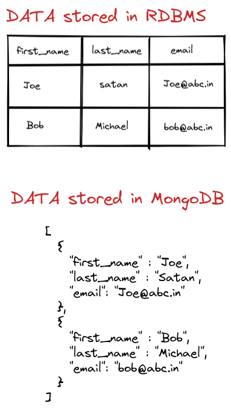

# MongoDB Database

* Before we understand what is MongoDB is we need to understand issues with traditional RDBMS.

## Problems with RDBMS(Relational DataBase Management system)

* Scalability

1. Difficult to scale millions of data
2. Data stored in multiple tables(relationship) it is difficult to scale

* Flexibility

1. Fixed data structures therefore not easy to make modifications to dataStructure
2. You need to spend hours and hours on designing the database before development.

* Performance

1. Data is generally stored across multiple tables.
Joins have huge performance impact as it requires lot of CPU and resources
2. Need to install and configure complex caching mechanism to make it faster.

## What is MongoDB ?

* It is A NoSQL database called(Document database)
* It stores data in flexible JSON-like document
    1. Easy to develop REST API in JSON
* It is highly scalable and flexible database

* **How MongoDB looks when compared to RDBMS?**

## Comparison between SQL and MongoDB

![image][Image-2.png]
