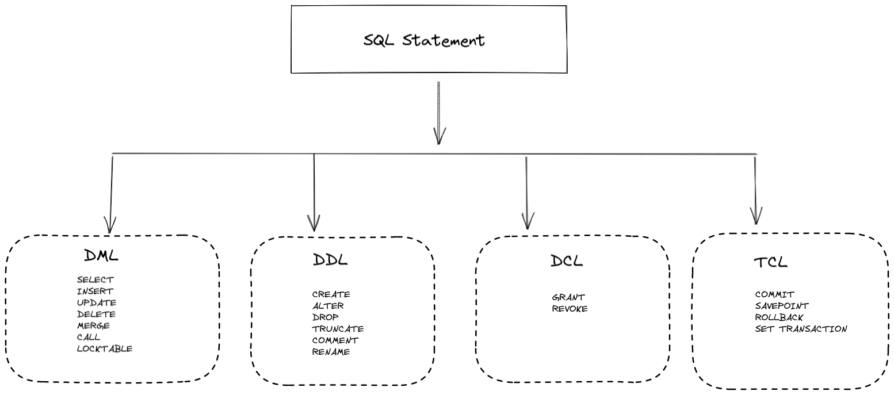
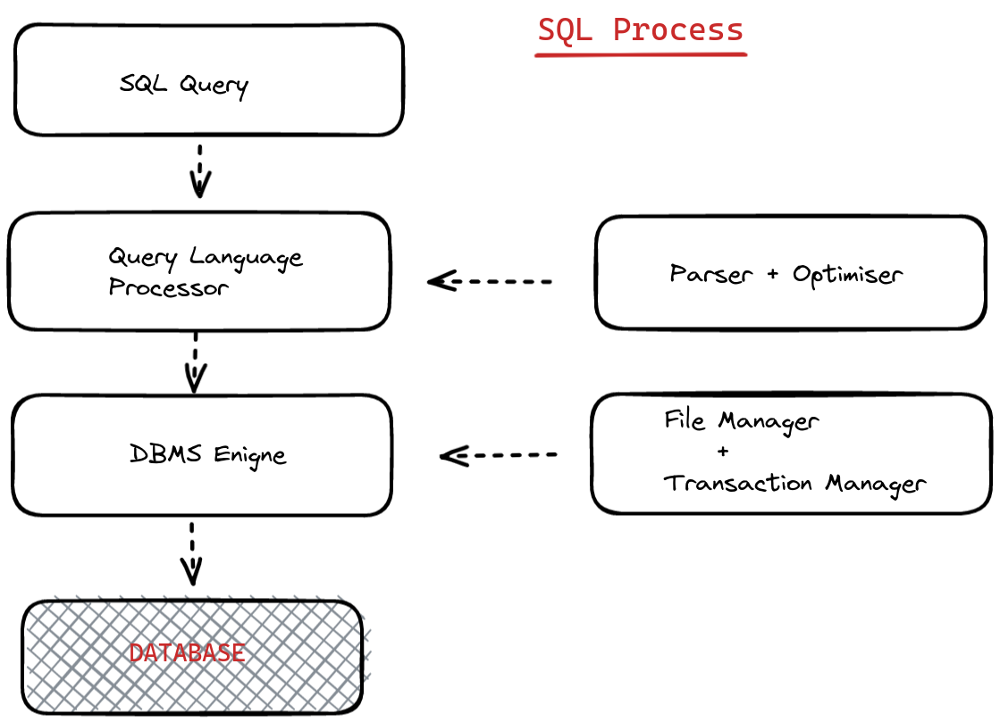

# Back-End Web Development

## Database

## What is Database ?

- A database is a systematic collection of data. They support electronic storage and manipulation of data.Databases make data management easy.

- **database example:** -- An online telephone directory uses a database to store data of people, phone numbers, and other contact details.your electricity service provider uses a database to manage billing.client-related issues,handle fault data etc.

## what is SQL and how does it work?

- SQL is the most common language for extracting and organising data that is stored in a relational database.A database is a table that consists of rows and columns.
- SQL is the language of databases.it facilitates retrieving specific information from databases that are further used for analysis.

There are five main components of a database:

- **HARDWARE**

The hardware consists of physical, electronic devices like computers, I/O devices, storage devices, etc. this offers the interface between computers and real-world systems

- **SOFTWARE**

This is a set of programs used to manage and control the overall database.This include the database software itself, the operating system, the network software used to share the data among users, and the application programs for accessing data in the database.

- **DATA**

Data is a raw and unorganized fact that is required to be processed to make it meaningful.Data can be simple at the same time unorganized unless it is organized.Generally, data comprises facts, observations, perceptions, numbers, characters, symbols, images etc.

- **PROCEDURE**

Procedure are set of instructions and rules that help you to use the DBMS. it is designing and running the database using documented methods,which allows you to guide the users who operate and manage it.

- **Database Access Language**:

Database Access Language is used to access data to and from the database, enter new data, update already existing data, or retrieve required data from DBMS. The user writes some specific commands in a database access language and submit these to the database.

## What is a Database Management System(DBMS)?

Database Management System(DBMS) is a collection of programs that enable its user to access databases,manipulate data, report , and represent data.it also helps to control access to the database.

## What is SQL ?

SQL(Structured Query Language) is the standard language for dealing with relational databases. SQL can be used to insert,search,update and delete database records.SQL can do lots of other operations, including optimizing and maintenance of databases.

-- **How to Use SQL**

```SELECT * FROM Members WHERE Age > 30```

### what is SQL used for ?

Here are important reasons for using SQL

- it helps users to access data in the RDBMS system
- it helps you to describe the data.
- it allows you to define the data in a database and manipulate that specific data.
- with the help of SQL, you can create and drop databases and tables.
- SQL offers you to use the function in a database, create a view, and stored procedure.
- you can set permissions on tables, procedures , and views

- 

- **Types of SQL Statements**

Here are five types of widely used SQL Queries.

1.Data Manipulation Language (DML)
2.Data Definition Language (DDL)
3.Data Control Language (DCL)
4.Transaction Control Language (TCL)
5.Data Query Language (DQL)

- **List of SQL Commands**

1.CREATE - Defines the database structure Schema.
2.INSERT - inserts data into the row of a table.
3.UPDATE - updates data in a database.
4.DELETE - Removes one or more rows from a table.
5.SELECT - selects the attribute based on the condition described by the WHERE Clause.
6.DROP   - Removes tables and databases.

- **SQL Process**

When you want to execute an SQL command for any DBMS System, you need to find the best method to carry out your request, and SQL engine determines how to interpret that specific task

Important components included in this SQL process are:

1.SQL Query Engine
2.Optimization Engines
3.Query Dispatcher
4.Classic Query Engine

A classic query engine allows you to manage all the non-SQL queries.



- **SQL Language Elements**

Here are the important elements of SQL Language

1.**Keywords**     : Each SQL statement contains single or multiple keywords
2.**Identifiers**  : Identifiers are names of objects in the database, like user IDs, tables, and columns.
3.**Strings**      : Strings can be either literal strings or expressions with VARCHAR or CHAR data types.
4.**Expressions**  : Expressions are formed from several elements, like constants, SQL operators, column names, and subqueries
5.**NULL Value**   : Use NULL, which helps you to specify a value that is unknown, missing, or not applicable.

- **What is a database in SQL ?**

A database is made up of a collection of tables that stores a detailed set of structured data. it is a table that contains a collection of rows, referred to as records or tuples, and columns that are also referred to as attributes.

Each column in the table is designed to store a specific type of information, for example, names, dates, dollar amounts, and numbers

- **What is NoSQL?**

NoSQL is an upcoming category of Database management Systems. Its main characteristic is its non-adherence to Relational Database Concepts. NoSQL means "Not Only SQL". The Concept of NoSQL databases grew with internet giants such as Google, Facebook, Amazon etc. who deal with gigantic volumes of data.

When you use a relational database for massive volumes of data, the system starts getting slow in terms of response time. to overcome this, we could "Scale up" our systems by upgrading our existing hardware. The alternative to the above problem would be to distribute our database load on multiple hosts as the load increases. This is known as "Scaling out".

NoSQL database is non-relational databases that scale-out better than relational databases and are designed with web applications in mind.

- **CREATE DATABASE**

CREATE DATABASE creates a new database, assuming the user running the command has the correct admin rights

```CREATE DATABASE dataQuestDB```

- **CREATE TABLE**

CREATE TABLE creates a new table inside a database. The terms int and varchar(255) in this example specify the datatypes of the columns we're creating
