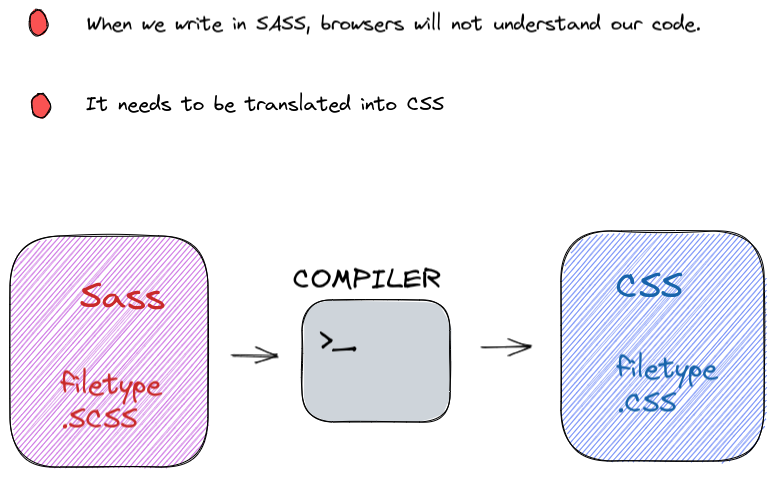

# SASS(Syntactically Awesome Style Sheets)

* Sass is the most mature, stable, and powerful professional grade CSS extension language in the world.

## Preprocessing

* CSS on its own can be fun, but stylesheets are getting larger, more complex, and harder to maintain.

* This is where a preprocessor can help. Sass has features that doesn't exist in CSS yet like nesting, mixins.

* Once you start tinkering with Sass, it will take your preprocessed file and save it as a normal css file that you can use in your website.

* You can also watch individual files or directories with the --watch flag.The watch flag tells Sass to watch your source files for changes, and re-compile CSS each time you ave your Sass.



## Advantages

1. Sass facilitates you to write clean, easy and less CSS in a programming construct.

2. It contains fewer codes so you can write CSS quicker.

3. It is more stable, powerful, and elegant because it is an extension of CSS.So, it is easy for designers and developers to work efficiently and quickly.

4. It is compatible with all versions of CSS. So, you can use any available CSS libraries.

5. It provides nesting so you can use nested syntax and useful functions like color manipulations, math functions and other values.

## Variables

* Think of variables as a way to store information that you want to reuse throughout your stylesheet.

* You can store things like colors, font stacks, or any CSS value you think you'll want to reuse. Sass uses ```$ symbol``` to make something a variable

* **SASS**

```sass
$myclr: red;
$bg: yellow;

h2{
    color: $myclr;
    background-color: $bg;
}
```

* **CSS**

```CSS
h1{
    color: red;
    background-color: yellow;
}
```

When the Sass is processed, it takes the variables we define for the $myclr and $bg and outputs normal CSS with our variables values placed in the CSS. This can be extremely powerful when working with brand colors and keeping them consistent throughout the site.

## Nesting

* When writing HTML you've probably noticed that it has a clear nested and visual hierarchy. CSS, on the other hand, doesn't.

* Sass will let you nest your CSS selectors in a way that follows the same visual hierarchy of your HTML. Be aware that overly nested rules will result in over-qualified CSS that could prove hard to maintain and is generally considered bad practice

* **SASS**

```sass
nav{
    ul{
        margin: 0;
        padding: 0;
        list-style: none;
    }
    li{
        display: inline-block;
    }
    a{
        display:block;
        padding: 6px 12px;
        text-decoration: none;
    }
}
```

* **CSS**

```CSS
nav ul{
    margin: 0;
    padding: 0;
    list-style: none;
}

nav li{
    display: inline-block;
}

nav a{
    display: block;
    padding: 6px 12px;
}
```

You'll notice that the ul, li and a selectors are nested inside the nav selector.This is a great way to organize your CSS and make it more readable
